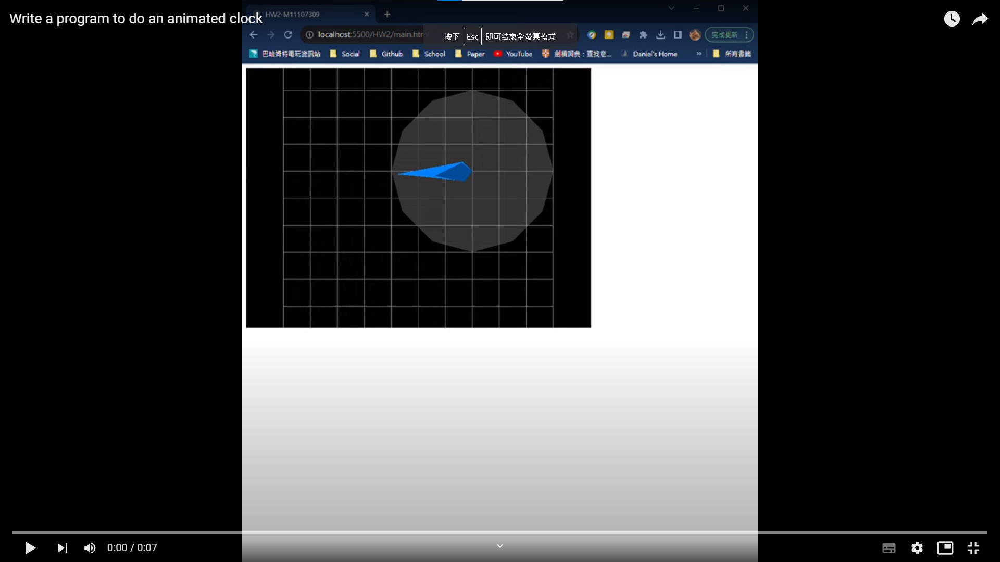

# HW2

 Write a program to do an animated ``clock``.

- Javascript
- HTML
- Visual Studio Code with ``live server``

## Description

1. Write or modify a program to show an animation with rotating hour and minute
hands at right positions.
2. In this assignment, please create a circle to present the body of a clock whose center us at (100, 50, 0). And, create extra two hands, (as a shape of diamond or triangle), and their rotation centers align with the body of clock. Finally, create a rotation animation.
Hint: the speed of minute hand is faster (12x) than hour hand’s.

## Install

Environment:

- WSL
- Ubuntu 22.04
- Visual Studio Code

Install:

- nvm
- Node.js
- npm

### nvm

Install ``nvm`` in the Ubuntu

```bash
sudo apt-get install curl

curl -o- https://raw.githubusercontent.com/nvm-sh/nvm/master/install.sh | bash
```

Resource the bash

```bash
source ~/.bashrc
```

Check nvm

```bash
command -v nvm

nvm ls
```

### Node.js

Install the **LTS** version

```bash
nvm install --lts
```

Check version of Node.js

```bash
nvm ls

node --version
```

### npm

Check the npm

```bash
npm -v
```

Install the JS library ``three``

```bash
npm install three
```

## Result

Watch the video

[](https://youtu.be/B283oqLbY8A)

## Reference

[在 Windows 子系統 Linux 版 (WSL2) 上安裝 Node.js](https://learn.microsoft.com/zh-tw/windows/dev-environment/javascript/nodejs-on-wsl)
