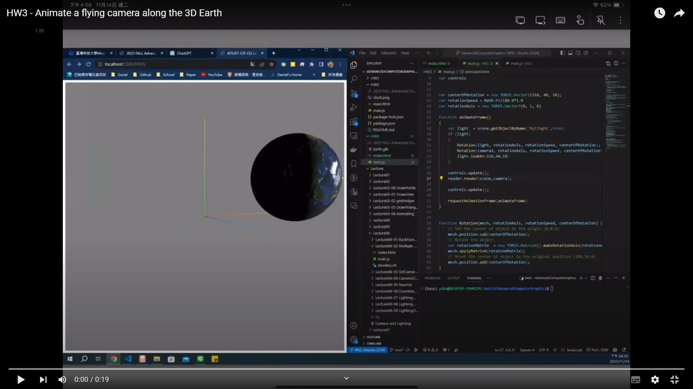

# HW3

Animate a flying camera along the trajectory of the equator of the 3D earth model.

## Description

1. Write a program (javascript, python or C/C++) to read the earth model (Earth.glb
file from NASA website) and create a flying camera along the trajectory of the equator.
2. Carefully locate your camera and adjust its pose in the virtual environment. Note:
the up-direction of the camera should be the reversed vector of gravity.
3. Create an animation perform the viewing scene from your virtual camera.
4. Geometry info: the center coordinate of the earth is (110,40,10), and its radius is 50.

## Result

Watch the video

