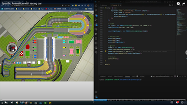

# HW3 - Midterm Project

Write a program to read obj/glb and Text (.xyz) files, then do an specific animation (a moving car on a lane) by openGL / webGL.

## Method

The calculateRotation function computes the **rotation** required to **smoothly** align an object with a target position in 3D space. It takes the current and target positions as input.

### Direction Vector D

It calculates a direction vector from the current to the target position, indicating the desired orientation

### Euler Angles

The function computes three Euler angles: yaw, pitch, and roll.
Yaw: Rotation around the vertical axis (upward).

- **Yaw**: Rotation around the vertical axis (upward).
- **Pitch**: Rotation around the lateral axis (side to side).
- **Roll**: Rotation around the longitudinal axis (front to back).

### Target Quaternion

Using the Euler angles, it creates a quaternion that represents the desired orientation.

### Smooth Rotation (Slerp)

To achieve a gradual and visually pleasing rotation, the code employs Slerp (Spherical Linear Interpolation). It smoothly interpolates between the current and target orientations, controlled by an interpolation factor.

### Return

To achieve a gradual and visually pleasing rotation, the code employs Slerp (Spherical Linear Interpolation). It smoothly interpolates between the current and target orientations, controlled by an interpolation factor.

## Result

